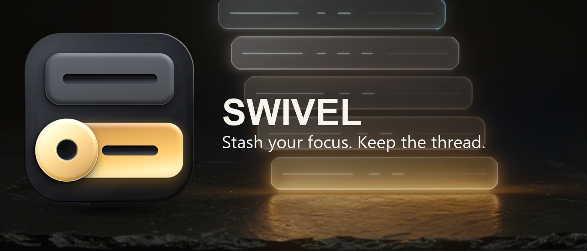

# swivel

**git stash, for attention.** A [Claude Code](https://claude.com/claude-code) skill that
keeps a long session's main thread recallable when other threads intrude.

A long agent session doesn't lose its purpose in one step. It services a reasonable
request, then another one prompted by that, until the conversation is three frames away
from what was actually being built, and nobody can say when it changed. Swivel names
that drift as it happens and writes the in-flight state to disk, so you can switch away
and come back to exactly where you were.

## What it does

- **One core lane per project.** The session's theme, declared once. Drift can't demote
  it; only you saying so can.
- **Injected lanes for everything else.** A thread that comes in from an inbox, a
  tracker or a notification still gets done, in full. Swivel logs it as injected,
  names it in one clause, and keeps a pointer back to the core.
- **A three-question test** for each new frame: where did it come from, does it have its
  own counterparty and clock, and does the core move if it's done perfectly?
- **Depth tracking.** At two levels of nesting it stops and re-states the core.
- **Reload after a compaction.** When the conversation is compacted and its detail is
  dropped, the lanes are the only full copy left, so they're read back before anything else.
- **Stashes that survive a cold read**: evidenced state (SHAs, URLs, message ids), whose
  ball each thread is in, the next physical action, landmines, and a computed timestamp.

## Install

Swivel is a Claude Code plugin, and this repo is also its marketplace. In Claude Code:

```
/plugin marketplace add ophiocus/swivel
/plugin install swivel@swivel
```

`/plugin` then handles updates. Releases are tagged (`v0.1.0`, …) and the version lives in
`.claude-plugin/plugin.json`.

Without the plugin system, the skill is one file, `skills/swivel/SKILL.md`. Copy that folder
into `~/.claude/skills/` (Claude Code), or zip it and upload it as a custom skill in the
Claude apps.

## Use

| Say | What happens |
|---|---|
| `swivel` / `swivel push` | Snapshot the current focus to disk, confirm, ask where to |
| `swivel to <thing>` | Push, then switch in one move |
| `swivel pop` | Restore the newest stash, re-verify it, mark it popped |
| `swivel apply` | Restore without marking |
| `swivel list` / `swivel show N` | Read the stack / one stash |
| `swivel drop N` | Mark dropped. Nothing is ever deleted |

It also triggers on "stash this", "park this and switch", "what was I doing" and
"what are we actually doing".

State lives in Claude Code's own per-project folder, beside that project's memory:
`~/.claude/projects/<project-slug>/swivel/` — `INDEX.md`, one `lane-*.md` per lane, and any
`CASE-*.md` precedents you choose to keep. It's plain Markdown, so you can read and diff it.
Nothing is written into your working tree, so lanes never appear in `git status` and can't
be committed by accident.

## Does it work?

[`docs/AUDIT.md`](docs/AUDIT.md) is an audit of the skill against its first three weeks
of real use: 20 session transcripts totalling 9.17 billion input tokens, across 11
workspaces. In brief:

| Finding | Verdict |
|---|---|
| Swivel's own reads and writes cost 0.35 % of input tokens | cheap, not free |
| A stash reads correctly five days later without the transcript | confirmed |
| Deep nesting gets recorded and stays recallable in one line | confirmed |
| Only 3 of 55 context compactions were followed by reading a stash back | "exact return" rarely exercised |
| `INDEX.md` files drift: two ACTIVE lanes, stale one-liners | verification happens at stash time, not after |
| Nothing in swivel cuts tokens per prompt | it buys recall, not spend |

The audit also contains a pre-registered, three-arm experiment plan for measuring token
cost per prompt properly. The scripts that produced the numbers are in [`bench/`](bench/).

## Layout

```
.claude-plugin/plugin.json       plugin manifest (name, version)
.claude-plugin/marketplace.json  this repo as a one-plugin marketplace
skills/swivel/SKILL.md           the skill itself
docs/AUDIT.md                    claims, anatomy, tests, token-bench plan
bench/swivel_usage.py            reproduces the audit's numbers
```

## Known gaps

From the audit, open as issues-to-be:

- The three-question test defines one outcome out of eight answer combinations.
- There's no stash filename convention (real use invented `stash-00N.md`).
- There's no invariant that exactly one lane is active.
- There's no `swivel core` command to re-state the theme, though users add one.

## Licence

MIT. See [LICENSE](LICENSE).
