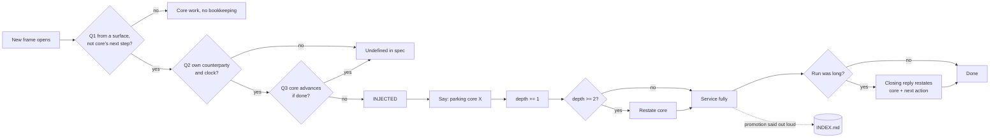
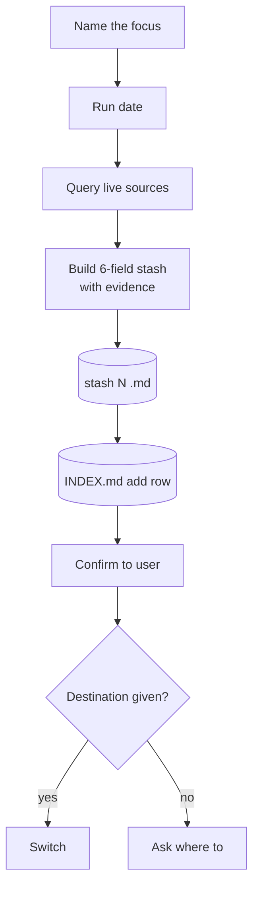
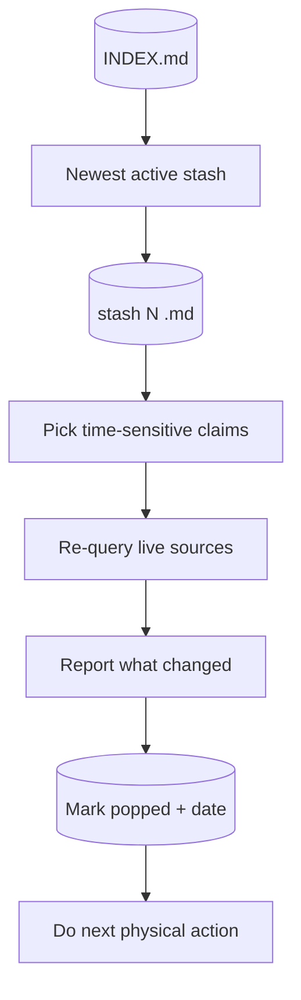
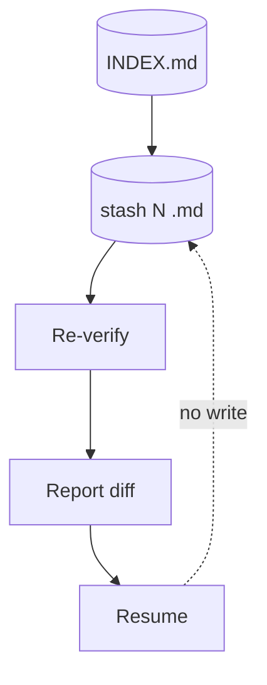
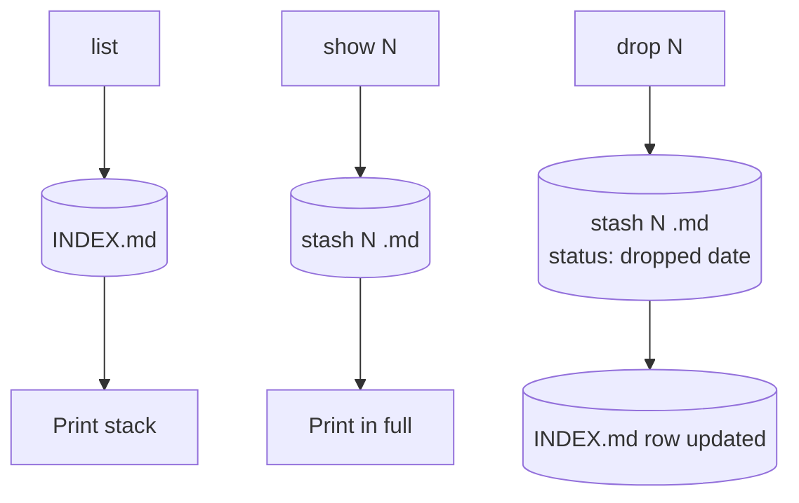

# swivel under test

An audit of the skill's claims, its anatomy, its per-command dataflow, eight tests
against real use, and a plan for measuring whether it saves tokens.

**Corpus:** every Claude Code session transcript that loaded swivel between
2026-08-28 and 2026-09-15 (20 sessions, 9.17 billion input tokens), plus the 11
`.swivel/` directories those sessions wrote. Numbers come from
[`bench/swivel_usage.py`](../bench/swivel_usage.py). Workspaces are anonymised as
project A, B, and so on. The script has no date filter, so running it later includes
sessions after 2026-09-15 and the totals move slightly: on 2026-09-18 it found 21
sessions and 0.36 % carried.

**Short version:** swivel is a cheap, effective way to keep a session's main thread
recallable. Nothing in it lowers tokens per prompt, and its "exact return" rarely runs
at the moment it would matter most.

---

## 1. The claims

Every benefit claimed in `SKILL.md` and its founding precedent, with a verdict that
points to the test in section 4.

| ID | Claim | Verdict |
|---|---|---|
| C1 | A context switch costs nothing | **T1**: cheap, not free |
| C2 | The return is exact | **T2**: rarely exercised |
| C3 | The main theme never gets lost; "what were we doing?" answers in one line | **T5**: the line exists and goes stale |
| C4 | Actively holding the core resists workspace gravity | untestable from logs |
| C5 | Re-stating the core at depth ≥ 2 prevents scope violations | **T7**: records, doesn't prevent |
| C6 | A stash survives a cold read a week later | **T8**: confirmed where written |
| C7 | Verifying at stash time prevents stale records | **T4**: indexes drift |
| C8 | Never-delete turns the stack into a session log | **T4**: confirmed |
| C9 | Re-verifying on pop catches how the world moved | **T2**: pops are rare |
| C10 | An injection serviced well is not a loss | **T7**: confirmed |
| C11 | Naming an injection costs one sentence and saves about four turns | counterfactual, n = 1 |
| C12 | The three-question test classifies any new frame | **T6**: 7 of 8 cases undefined |
| C∅ | *Implied, never stated:* swivel lowers token spend | **T3**: not as practiced |

Tally: 4 confirmed, 6 challenged, 1 refuted, 2 untestable.

---

## 2. Anatomy

There is no code. The skill is one Markdown file of about 7 KB, and the model carries
out every command with its ordinary Read, Write and Edit tools. The file has six parts:

| Part | Content |
|---|---|
| frontmatter | name, plus a trigger description covering six phrases and one semantic trigger |
| doctrine | core vs injected, the three-question test, workspace gravity, nesting depth, five rules |
| storage | `lane-*.md`, `INDEX.md`, `CASE-*.md`. At audit time these sat in `<project>/.swivel/`; v0.1.1 moved them to `~/.claude/projects/<slug>/swivel/`, out of the code tree |
| commands | push, pop, apply, list, show N, drop N; "swivel to X" means push, then switch |
| stash contract | headline, evidenced state, whose ball, next action, landmines, computed timestamp |
| rules + format | verify first, re-verify on pop, never delete, one stash per focus, tracker wins |

The data model and control logic the prose implies, as typed pseudocode. Lines marked
`GAP` are places where the prose leaves behaviour undefined and real use invented
something.

```ts
type Kind   = "CORE" | "INJECTED";
type Status = "active" | `popped ${Date}` | `dropped ${Date}`;

interface Lane {                       // .swivel/lane-<name>.md
  kind: Kind;                          // exactly one CORE per project
  injectedOff?: LaneRef;               // required when INJECTED
  openedAt: Timestamp;                 // from `date`, never inferred
}

interface Stash {                      // swivel@{n}; newest n is @{0}
  n: number;                           // monotonic
  // GAP: no filename given. Lanes are lane-*.md; real stashes became stash-00N.md
  headline: string;
  stashedAt: Timestamp;
  status: Status;
  liveState: Claim[];                  // each claim carries evidence
  whoseBall: { thread: string; ball: "ours" | "theirs"; unblock: string }[];
  nextAction: string;                  // "act with no thinking"
  landmines: string[];
}
interface Claim { text: string; evidence: SHA | URL | MessageId | RowRef }

interface Index {                      // .swivel/INDEX.md
  core: LaneRef; active: LaneRef; ancestry: Tree<LaneRef>;
  // GAP: no invariant that `active` is unique
}

// Always-on guard: runs whenever a new frame opens
function classify(f: Frame): Kind {
  const fromSurface = !f.isCoreNextAction;
  const ownClock    = f.hasOwnCounterparty && f.hasOwnClock;
  const coreMoves   = f.advancesCoreIfDone;
  if (fromSurface && ownClock && !coreMoves) return "INJECTED";
  // GAP: the other 7 of 8 combinations are unspecified. Real use invented
  // "core sub-focus", "own next step, not injected", "user directive (fresh frame)"
  return "CORE";
}

function onFrameOpen(f: Frame, s: Session) {
  if (classify(f) === "INJECTED") {
    say(`parking core ${s.core} for this`);   // one clause, not a lecture
    s.depth++;
    if (s.depth >= 2) restateCore(s);
  }
  service(f);                                 // never refuse
  if (s.injectedRunIsLong) closeWithPointerHome(s);
  // GAP: "long" is undefined, and nothing ever decrements depth
}

// Commands
push(focus)  → verify(liveSources) → write(Stash{n: next()}) → index.add → confirm → ask(dest)
pop()        → s = index.newestActive() → load(s) → reverify(s.timeSensitive) → diff → s.status = popped
apply()      → pop() without the status change
list()       → print(INDEX.md)
show(n)      → print(stash n)
drop(n)      → stash(n).status = dropped      // the file is never deleted
// GAP: no `swivel core` command to re-state the theme; users add one to INDEX.md
// GAP: nothing reloads the active lane after a context compaction
```

---

## 3. Dataflow per method

Rectangles are model actions, cylinders are files on disk. "Live source" means whatever
the lane's claims point at: git, an inbox, a tracker.

### Frame guard (always on)



### push



### pop



### apply



### list · show N · drop N



---

## 4. Tests

All eight are observational. Section 5 is the controlled version.

### T1: What swivel's own reads and writes cost (C1 confirmed as cheap)

A stash file is small when written, but its text stays in context and is re-sent on
every later call until the next compaction. So each `.swivel` read or write is weighted
by the number of calls it rode along for.

- 0.18 M tokens written directly; **32.4 M carried**, out of 9,170 M total input: **0.35 %**.
- Worst case: 6.5 % in a 28-call session that read five lanes at startup.
- Overhead is negligible in long sessions and noticeable only in short ones.

### T2: Is the exact return used when context is lost? (C2 and C9 challenged)

Compaction throws away the transcript's working memory, so it's the moment on-disk lanes
should pay off. The test asks whether a `.swivel` read happened within 8 calls after
each compaction boundary.

- **55 compactions, 3 followed by a swivel read.** 137 lane reads against 206 writes.
- In practice the return runs on the compaction summary, not the stash. Lanes are
  written far more than they're restored, and nothing triggers a reload after compaction.
- **Addressed in v0.1.2**: "a compaction is a cache miss — reload" is now a rule, so the
  lanes are read back at the one moment the transcript can no longer supply the state.
  Whether it changes the 3-in-55 ratio is itself measurable — re-run
  `bench/swivel_usage.py` and compare `reloads_after_compaction` before and after.

### T3: Does per-prompt context shrink after swivel loads? (C∅ refuted as practiced)

- Median context per call rose after the first swivel load in **18 of 20** sessions.
- 10 sessions peaked between 954 K and 999 K tokens, the limit of the 1M-context window.
- This is confounded, because sessions grow with time regardless. Still, it rules out any
  mechanism: stashing copies state to disk and drops nothing from the transcript. The
  two sessions where the median fell had a compaction right after swivel loaded.

### T4: Do the indexes stay true? (C7 challenged, C8 confirmed)

- **Project B:** the header names one lane ACTIVE while the table marks it parked and
  another active. Two more lanes are "parked" in the stack but "active" in the recall
  list.
- **Project A:** the one-line core statement still counts an item as advancing that the
  project's own `stash-003.md` records as closed.
- Verification happens when a stash is written, but INDEX rows get edited piecemeal and
  never re-checked. History is fully intact, since nothing was deleted.

### T5: What does one-line recall actually cost? (C3 challenged)

- Project A's `INDEX.md` is 7.8 KB, about 2 K tokens over 62 lines. The one-line core
  statement sits on line 23, below a 16-row table whose cells run past 100 words.
- The one-liner exists, which is the win. But the index has grown into a second status
  tracker (which "the canonical tracker still wins" forbids), and the one-liner is stale.

### T6: Does real use stay within the spec? (C12 challenged)

- Invented in the wild: stash files named `stash-00N.md`; a `swivel core` command;
  statuses "reflogged", "resolved", "parked", "dead"; kinds "core sub-focus", "own next
  step, not injected", "user directive (fresh frame)".
- Each fills a hole in the section 2 model. The three-question test defines one outcome
  out of eight answer combinations, and users patch the other seven with new categories.

### T7: Does the depth rule stop nesting? (C5 challenged, C10 confirmed)

- Project B's ancestry reaches depth 3 (platform ops → analytics migration → ad
  consent → deploy pipeline). Every lane on that chain shipped something real.
- The rule makes deep nesting visible and recorded, not prevented. That fits "never
  refuse", but "prevents scope violations" overstates it. The core stayed recallable.

### T8: Does a stash survive a cold read? (C6 confirmed)

- A stash read five days after it was written: every moved row cites a thread or
  message id, a 10-row whose-ball table, two ordered next actions with a deadline, and
  eight landmines. At least two of those landmines (a UTC-versus-local date mis-stamp,
  Windows backslash collapse) had already been costly re-discoveries elsewhere. It
  reads cold without the transcript.

---

## 5. Plan: does swivel spend fewer tokens per prompt?

**Pre-registered prediction.** Swivel as written adds about 0.35 % and removes nothing
from context, so it should *not* win on tokens per prompt. It can only win if a push is
paired with dropping context (a compact, or a fresh session seeded from the lane file).
The plan tests three arms, so a null result for swivel-as-written can't bury a real one
for swivel-plus-shed.

### Hypotheses

| ID | Statement | Decision rule |
|---|---|---|
| H1 | Arm C (swivel + shed) spends fewer weighted tokens per prompt than arm A (no swivel) | 95 % bootstrap CI of C/A lies entirely below 1.00 |
| H2 | Arm B (swivel as written) is no cheaper than A | B/A CI includes 1.00 or lies above it |
| H3 | C's savings don't cost quality | C is non-inferior to A on recall (margin −0.5/10) and passes the same acceptance tests |
| H4 | Swivel reduces re-discovery after a return | B and C repeat fewer identical tool calls within 10 calls of a return than A |

### Arms

| Arm | Setup | Prediction |
|---|---|---|
| A: baseline | Skill *not installed*. The same scripted prompts in plain language | reference, 1.00 |
| B: swivel | Skill installed as written; the trigger phrases in the script fire it | ≈ 1.00–1.01 |
| C: swivel + shed | As B, and after every push the harness compacts to the lane, or restarts with "swivel pop" | < 1.00 if lanes carry enough |

### Phases

1. **Observational baseline (done: section 4).** Extend `bench/swivel_usage.py` to pull
   non-swivel sessions from the same projects, matched on call count (±20 %) and
   compactions. Use the matched pairs to set the expected effect size.
2. **Fixture.** A small real codebase (for example, a Python ordering service, about 40
   files, pytest) reset to a tag before every run. The core task is one feature across
   three modules with 12 hidden acceptance tests. Ambient surfaces inside the fixture
   (`inbox/`, a failing `ci/last-run.log`, a security advisory, a `tracker.csv`) generate
   at least 5 swivels at depths 1–3. There are 48 fixed prompts, each typed
   `work`/`switch`/`return`/`probe`, identical across arms. Four recall probes are graded
   0–10 by a separate model, blind to arm.
   *Gate: the scenario runs end to end in arm A with acceptance tests green.*
3. **Harness.** A fresh config directory per run: no user instructions, no memory, no
   MCP servers, and the skill only in B and C. Pin the model, effort, permission mode
   (inside a throwaway container) and tool allowlist. Drive one session with
   `claude -p --resume <id> --output-format stream-json`, capturing every `usage` block.
   Use a fixed delay between prompts in all arms so cache TTL behaves the same.
   *Gate: two identical A runs differ by less than 15 % in total weighted tokens.*
4. **Pilot, then power.** Run 2 per arm to estimate variance. Then size the main study
   to detect a 10 % difference at α = 0.05 and power 0.8, using a paired design over
   prompt index. Price it against the current published rates, not remembered ones.
5. **Measure.**
   - Primary: weighted tokens per user prompt, meaning Σ(input·w_in + cache_write·w_cw +
     cache_read·w_cr + output·w_out) over that prompt's calls, with any shed calls
     counted.
   - Secondary: raw tokens, peak context, compactions, calls per prompt, wall time.
   - Quality: acceptance tests, recall score, injection tasks resolved, re-discovery
     count.
   - Break everything down by prompt type as well.
6. **Analyse and decide.** A paired bootstrap (10,000 resamples) of the ratio per arm
   pair, plus a Wilcoxon signed-rank test as a check. Apply H1–H4 exactly as written, and
   plot cumulative weighted tokens against prompt index with switches and returns marked.
7. **Feed back.** If H1 holds, add a shed step to push and a reload-on-compaction rule.
   If it fails but H3 and H4 hold, state in `SKILL.md` that swivel buys recall and
   correctness, not tokens. Either way, record the result as a `CASE-*.md` precedent.

```python
# harness sketch
for arm in shuffled(["A", "B", "C"] * RUNS):
    cfg = fresh_config(skill=(arm != "A"))
    repo = reset_fixture(tag="bench-v1")
    sid = None
    for i, p in enumerate(load("scenario.yaml")):
        sid, usage = claude_p(p.text, resume=sid, cfg=cfg, cwd=repo)
        log(arm, run, i, p.type, usage)
        if arm == "C" and p.type == "switch":
            sid, usage = claude_p("/compact keep only the active lane and core pointer",
                                  resume=sid, cfg=cfg, cwd=repo)
            log(arm, run, i, "shed", usage)     # shed cost counts against C
        sleep(20)
    score(repo.run_acceptance_tests(), grade_probes(arm, run))
```

### Threats to validity

| Threat | Mitigation |
|---|---|
| Scripted prompts can't react to model output | Every prompt is self-contained; failed runs are reported, not dropped |
| The skill description costs tokens even when unused | Count it as treatment; add an A′ arm with the skill installed but never triggered |
| Compaction fires at different points in each arm | Report compactions; also run a variant with auto-compaction disabled |
| Cache TTL and server-side misses add noise | Fixed delays, interleaved arms, cache read and write reported separately |
| The fixture favours swivel by design | The injection schedule is fixed before any B/C run and mirrors a real depth-3 ancestry |
| Model version changes mid-study | Pin the model id, finish inside one window, log the model from each response |
